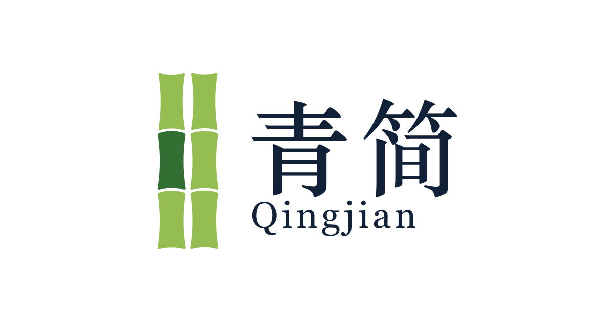

<p align="center">
  
</p>

<p align="center">
  <a href="https://qingjian.app">qingjian.app</a> ·
  <a href="https://github.com/qingjian-team">GitHub</a>
</p>

> 输入的不只是文字。

这是青简输入法的官方网站。

## 青简是什么

青简（Qingjian）是一个用 Rust 写的拼音输入法。它的目标不只是「把拼音变成汉字」，
而是让输入本身成为一种轻量、持续、几乎没有额外负担的语言接触方式。

打字时，候选词旁边多一条你正在学的那门语言的译词：

```text
1  开发            development
2  编程            programming
3  架构            architecture
4  编译            compile
5  语言            language
```

候选词仍然是主体，译词只是较小、较浅的辅助信息。把学习语言换成日语，同样的候选会显示「開発 / 学習 / 言語」。

**一次只学一种语言。** 青简不会在一个候选旁边同时塞进英语、日语、韩语、德语。保持输入干净，比堆砌信息重要。

## 为什么叫「青简」

「简」是古代记录文字的载体，竹木成简，文字成书。「青简」也常用来指代书籍、典籍与文字记录。
这个名字保留了中文书写文化的意味，又不把输入法未来支持的语言限制死。青简首先面向中文使用者，但不准备永远只做中文输入法。

## 核心想法

聊天、写代码、搜索、记笔记、写文档、发邮件，大量时间其实都花在输入文字上。
如果这些每天发生几百次的输入动作本身就能顺便给一点语言反馈，学习就从「专门腾时间」变成日常的一部分。

输入的时候，顺便多认识一个词。不打断，不弹题，不强迫记忆，只是把译词悄悄放在那里。

## 它做到了什么

- **好用的拼音输入法先行**：整句转换、拼写纠错、模糊音、双拼、英文模式、emoji，输入效率不为学习让路。
- **候选旁的译词**：随包释义表带词性，英语与日语可选，一个候选只显示一条。
- **生词标记**：在候选窗口里见得还不多的译词画成橙色，看熟了自动消失。
- **越用越顺**：词频、用户词、个人 n-gram、个人敲错表全在本机学习。
- **统计**：偏好设置里能看到今天 / 最近 7 天 / 累计打了多少字，折成几本《某书》，以及学习语言按 CEFR / JLPT 等级的词汇数。
- **可选的云联想**：缺省关闭，打开后组句时向你自己填写的 AI 服务商要词和整句补全，随包释义表没有的词也会补一条译词。

## 隐私

青简不上传任何数据。拼音转换、词库、学习、释义全部在本机完成，没有账号，没有统计上报。
云联想缺省关闭，打开后数据直接从你的电脑发到你自己填写的服务商，不经过青简（青简没有自己的服务器），密码框里绝不发送。
详细说明见主仓库 README 的「隐私」一节。

## 平台

核心引擎平台无关，各平台只负责接入系统输入接口与候选窗口：

```text
macOS    → Input Method Kit (IMK)      已可用（测试版）
Windows  → Text Services Framework    计划中
Linux    → IBus / Fcitx               计划中
```

## 不打算做什么

- 在候选框塞入五六种语言
- 每输入几个词就弹出测试
- 强制用户背单词
- 用复杂 UI 干扰正常输入
- 为了学习功能牺牲输入效率

如果用户需要思考「我现在到底是在打字还是在背单词」，那青简大概就设计错了。

## 状态

测试版，作者自用中，正在给少数测试者打包。安装包、文档与更新日志都会放到 [qingjian.app](https://qingjian.app)；
源码、设计文档与路线图在 [GitHub 主仓库](https://github.com/qingjian-team/qingjian)。

## 下载页的数据从哪里来

下载页不手写版本：`scripts/sync-releases.mjs` 在 `pnpm dev` / `pnpm build` / `pnpm check` 之前从主仓库最新 Release 上拉 `releases.json`
（每次发版由主仓库 CI 生成：版本、渠道、更新日志、提交哈希、构建时间、各平台安装包的地址、大小与 SHA-256，结构见主仓库 `docs/notes/release.md`），
写到 `src/content/releases.json`（不进 git）。拉不到时沿用本地上一次的文件，本地从没拉过就报错。`QINGJIAN_RELEASES_SOURCE` 可以指定别的 URL 或本地文件。
主仓库发了新版本后，官网重新构建一次即可。

## 文档页从哪里来

「文档」页不在这个仓库里写，内容源是主仓库的 `docs/user/`（Markdown，一个文件夹一个分组，一个文件一页，约定见那里的 README）。
`scripts/sync-docs.mjs` 在 `pnpm dev` / `pnpm build` / `pnpm check` 之前自动跑，把它同步到 `src/content/docs/`（图片到 `static/docs-assets/`，两处都不进 git），
`/docs/[...path]` 路由按目录结构渲染并全部预渲染成静态页，`sitemap.xml` 也据此生成。

来源的选择：

| 场景            | 来源                                                                                                      |
| --------------- | --------------------------------------------------------------------------------------------------------- |
| 本地开发        | 相邻目录 `../ime/docs/user`（主仓库）存在就直接读，改文档不用提交就能预览                                     |
| CI（`CI=true`） | 从 git 稀疏拉取主仓库的 `docs/user`（`QINGJIAN_DOCS_REPO` / `QINGJIAN_DOCS_REF`；主仓库公开，不需要令牌） |
| 手动指定        | `QINGJIAN_DOCS_SOURCE=git` 强制走 git，或给一个本地目录路径                                               |

部署用 Cloudflare Workers 的 Git 集成（Workers Builds）：push 到 main 自动构建。构建命令 `pnpm build`，部署命令 `npx wrangler deploy`，根目录 `/`；
构建环境按 `package.json` 的 `packageManager` 选 pnpm 版本（锁文件是 pnpm 11 生成的，用 10 装会报 `packages field missing`）。
主仓库的文档或 Release 更新了而官网没改时，在 Cloudflare 控制台重试一次最近的构建即可。

## 许可

站点代码以 **GPL-3.0-or-later** 发布（见 [LICENSE](LICENSE)），与主仓库一致。「青简」名字与 logo（`static/brand/`、`static/assets/logo.png`）不在授权范围内；
文档页的内容来自主仓库 `docs/user/`，随主仓库的许可。

## 品牌资源

`static/brand/` 里是两张 logo：

| 文件                           | 用途                                                           |
| ------------------------------ | -------------------------------------------------------------- |
| `qingjian-mark.png`            | 纯图标，透明底。favicon、头像、深色背景上用。                  |
| `qingjian-logo-horizontal.png` | 横版组合标（图标 + 青简 + Qingjian），白底。页头、分享卡片用。 |

图案是一卷竹简收在对话气泡里：竹简对应「简」，气泡对应输入与交流。

---

<p align="center">
  <strong>青简 Qingjian</strong><br/>
  输入的不只是文字。
</p>
